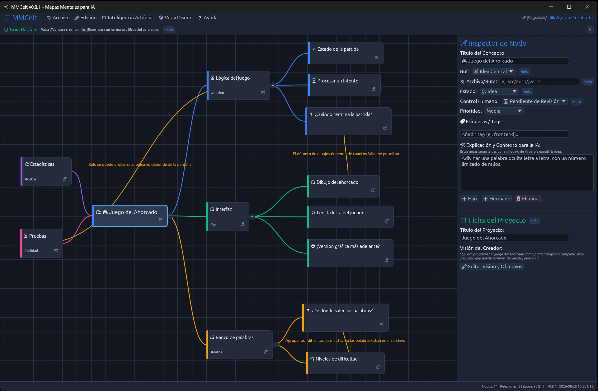
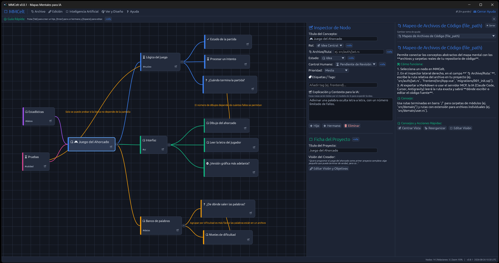

<p align="center">
  
</p>

# MMCelt

Aplicación de escritorio para construir mapas mentales que sirven de plano de trabajo y de
control sobre lo que hace un modelo de inteligencia artificial. Escrita en Rust, con
interfaz nativa (`egui` / `eframe`).

## Sobre Celtilander

Soy un usuario novel en el mundo de la programación y la IA. He «ayudado a crear» esta app y
espero que a alguien le pueda servir para algo... sin más.

Lo que no funciona no lo escondo: está escrito en
[defectos conocidos](documentacion/defectos-conocidos.md). Si encuentras algo que no esté ahí,
cuéntamelo.

Saludos a todo el mundo.

## El problema que resuelve

En un proyecto largo con una IA, la conversación se convierte en un hilo interminable donde
el modelo pierde el rumbo: vuelve sobre decisiones que ya se habían descartado, inventa una
arquitectura distinta a la acordada y da por bueno lo que nadie ha revisado.

Un mapa mental no se desordena. Lo que hay decidido está a la vista, lo que está pendiente
también, y lo que se descartó sigue ahí escrito con el motivo. MMCelt convierte ese mapa en
el documento que se le pasa al modelo, y en el sitio donde se le corrige cuando se desvía.

## Las dos direcciones

El mapa viaja en los dos sentidos, y el trabajo es distinto según quién empiece.

**Tú diseñas, la IA construye.** Dibujas los módulos, las dependencias entre ellos y las
rutas de los archivos que le corresponden a cada uno. Al exportar con `Ctrl+E` obtienes un
documento Markdown que el modelo interpreta como el plano que debe seguir, con un diagrama
Mermaid incluido.

**La IA propone, tú supervisas.** El modelo genera el mapa con su propuesta y tú lo abres
en MMCelt. Marcas lo que no vale como *Descartado* o *Requiere corrección*, escribes en el
nodo qué está mal y por qué, y devuelves el mapa. Esa corrección viaja dentro del archivo:
no es una sugerencia que el modelo pueda pasar por alto en el siguiente mensaje.

**Y el mapa puede volver solo.** Con `🤖 Inteligencia Artificial → Enviar a…` preparas un
expediente visible para uno de los agentes detectados. Si dispone de consola, MMCelt la abre; si
solo dispone de MCP, deja el trabajo preparado para que lo recojas desde la interfaz del agente.
Cuando el agente usa las herramientas MCP para devolver avances, **ves el mapa cambiar en
pantalla** sin exportarlo, pegarlo ni importarlo a mano.

Si tienes cambios sin guardar cuando el modelo devuelve el suyo, **tu trabajo no se toca**: se
te avisa y decides tú. Y un indicador `🟢` en la barra superior recuerda que la vigilancia está
activa, con `⏹ Detener seguimiento` para cortarla en un clic.

## Cómo se ve

<p align="center">
  
</p>

El mapa a la izquierda y el **Inspector de Nodo** a la derecha, donde se define el rol de
cada concepto, su estado, la prioridad, la ruta del archivo de código que le corresponde y
las notas que leerá el modelo. Las líneas de colores con texto son las **conexiones
cruzadas**: dependencias entre ramas distintas, con el motivo escrito encima.

<p align="center">
  
</p>

Y la **Ayuda Detallada**, con temas que explican cada parte del programa sin salir de él.
Está traducida, como el resto de la interfaz, a castellano, inglés, francés, alemán, ruso y
chino simplificado.

## Qué hace

**Un solo archivo.** El ejecutable no necesita instalador, ni WebView2, ni Node, ni Python. Se
copia a un lápiz de memoria y funciona.

**Lienzo infinito.** Paneo con el botón central o derecho, zoom con la rueda centrado en el
cursor, y disposición automática en árbol horizontal, radial o libre.

**Pensado para código.** Cada nodo puede llevar la ruta del archivo que representa
(`src/auth/jwt.rs`). El escáner recorre una carpeta de código y levanta el mapa de la
estructura solo. Hay plantillas de arquitectura limpia y de aplicación web completa para
empezar con algo montado.

**Servidor MCP dentro del ejecutable.** Arrancado con `--mcp-server`, el mismo archivo
habla JSON-RPC por la entrada estándar y deja que un agente lea y escriba mapas
directamente en el disco, dentro de la carpeta que se le indique y solo dentro de ella. No
hay que instalar nada aparte, que es lo que permite pasarle el programa a otra persona y
que le funcione.

**Conexión con los agentes en un clic.** El menú `🤖 Inteligencia Artificial → Conectar
MMCelt con mis IAs` busca los agentes instalados en el equipo, los muestra y los configura,
haciendo antes una copia de seguridad de sus archivos de configuración.

**Guardado automático.** Con un intervalo configurable, si el mapa ha cambiado se guarda una
copia en los datos del usuario. Si el programa se cierra de forma inesperada, al volver a
abrirlo ofrece recuperar ese trabajo.

**Prioridad e indicadores de revisión, siempre visibles.** El nodo dibuja el icono de su
prioridad (🔽 Baja, 🔷 Media, ⚡ Alta, 🔥 Crítica) y el de su estado de supervisión humana
(⏳ Pendiente, 🤖 Generado por IA, 🛡️ Aprobado, ⚠️ Requiere corrección), y el mismo icono
aparece en los selectores del inspector: lo que ves en el nodo es lo que eliges en el menú.

**Buscador combinable.** Filtra por texto, por estado y por prioridad a la vez, con la
opción de ordenar los resultados por prioridad.

**Formatos abiertos de intercambio.** Exporta e importa OPML y FreeMind/Freeplane `.mm`. Un
archivo propio de MMCelt recupera al reimportarlo estado, prioridad, rol, revisión, notas,
posición y conexiones cruzadas exactos; uno ajeno entra con valores por defecto y se
distribuye automáticamente en el lienzo para no amontonar los nodos en un punto.

**Tamaño de interfaz ajustable.** Con `Ctrl` `+`, `Ctrl` `-` y `Ctrl` `0` se agranda o
reduce toda la interfaz, entre el 50 % y el 300 %, pensando en monitores 4K y en
televisores. El ajuste se recuerda entre sesiones.

**Tres temas.** Oscuro, claro y de alto contraste. Los colores están comprobados con
pruebas automáticas contra los mínimos de contraste de la norma WCAG 2.1, así que ningún
texto queda por debajo del umbral de legibilidad sobre su propio fondo.

**Ayuda dentro del programa.** Junto a los controles hay explicaciones breves con un botón
de `+info` que abre, en el panel lateral, la guía completa del asunto.

**Seis idiomas, sin cadenas a medias.** Castellano, inglés, francés, alemán, ruso y chino
simplificado, en el menú `Ver y Diseño → Idioma / Language`. No es solo la interfaz: van
traducidos los menús, el inspector, los diálogos, las guías de ayuda y **el documento que se
le entrega a la IA**, que es el que más se nota. Además, incluye un subconjunto embebido de
la fuente Noto Sans SC para renderizar caracteres CJK de forma nativa en cualquier sistema
operativo sin dependencias externas.

Lo que **no** se traduce es deliberado: los nombres de los campos del archivo `.mmcelt`, las
claves del protocolo MCP y las de la configuración de los agentes. Son formato, no texto para
leer, y traducirlos rompería los mapas guardados y la conexión con los agentes.

## Atajos

| Atajo | Acción |
| :--- | :--- |
| <kbd>Tab</kbd> | Crear un nodo hijo del seleccionado |
| <kbd>Enter</kbd> | Crear un nodo hermano, al mismo nivel |
| <kbd>Supr</kbd> / <kbd>Retroceso</kbd> | Borrar el nodo y todo lo que cuelga de él |
| <kbd>Espacio</kbd> / <kbd>F2</kbd> / doble clic | Editar el título en el lienzo |
| Arrastrar con el botón central o derecho | Desplazar la vista |
| Rueda del ratón | Acercar y alejar el mapa |
| <kbd>Ctrl</kbd>+<kbd>Z</kbd> / <kbd>Ctrl</kbd>+<kbd>Y</kbd> | Deshacer / rehacer |
| <kbd>Ctrl</kbd>+<kbd>S</kbd> | Guardar |
| <kbd>Ctrl</kbd>+<kbd>E</kbd> | Exportar el Markdown para la IA |
| <kbd>Ctrl</kbd>+<kbd>F</kbd> | Volver al nodo raíz |
| <kbd>Ctrl</kbd>+<kbd>+</kbd> / <kbd>Ctrl</kbd>+<kbd>-</kbd> / <kbd>Ctrl</kbd>+<kbd>0</kbd> | Agrandar, reducir o restablecer la interfaz |

## El documento que recibe la IA

`Ctrl+E` genera un Markdown pensado para que el modelo razone sobre el proyecto, no para
que lo lea una persona. Lleva, por este orden: las instrucciones de rol y contexto; la
visión del creador y los objetivos, que es donde se explica qué se busca de verdad; un
recuento de nodos y estados; la estructura jerárquica completa con las notas y las rutas de
código; las conexiones cruzadas entre ramas distantes; las dudas y los puntos de decisión
pendientes, aparte y destacados; un diagrama Mermaid; y varios prompts preparados para
pedir un plan de acción o una auditoría.

## Conectarlo con tu IA

**MMCelt se conecta con tres agentes de consola: Claude Code, Codex CLI y Gemini CLI.** Son
los tres que se han probado de principio a fin; el servidor MCP integrado no depende de
ninguno de ellos en particular, así que conectar otro cliente compatible con MCP es
cuestión de que el propio cliente lo permita.

> **Gemini CLI:** Google exige una cuenta autorizada o una clave de API para usarlo —ya no
> admite una cuenta personal estándar—. MMCelt lo avisa en la ficha del agente, en los seis
> idiomas.

Las guías por plataforma están en
[`documentacion/integraciones/`](documentacion/integraciones/):

- [Manual de control con IA](documentacion/integraciones/manual-de-control-ia.md) — los dos
  flujos de trabajo explicados de principio a fin. Empieza por aquí.
- [Claude, por MCP](documentacion/integraciones/claude-mcp.md) — **Claude Code** es el agente
  integrado.
- [ChatGPT y OpenAI](documentacion/integraciones/chatgpt.md) — ChatGPT web con copia manual y
  **Codex CLI**, que es el agente integrado.
- [Gemini y Google](documentacion/integraciones/gemini.md) — Gems y contextos largos.
  **Gemini CLI** es el agente integrado.

## Compilar y ejecutar

```bash
git clone https://github.com/celtidcs/mmcelt.git
cd mmcelt
cargo build --release        # deja el ejecutable en target/release/mmcelt
cargo test --all-features    # la batería completa
```

Requiere Rust 1.85 o superior. No hay ninguna otra dependencia: el servidor MCP va dentro del
ejecutable. La guía completa está en
[`documentacion/infraestructura/guia-de-clonado.md`](documentacion/infraestructura/guia-de-clonado.md),
con scripts que automatizan la instalación:
[`preparar-entorno.ps1`](documentacion/infraestructura/preparar-entorno.ps1) para Windows y
[`preparar-entorno.sh`](documentacion/infraestructura/preparar-entorno.sh) para Linux y macOS.

El ejecutable admite dos argumentos:

```bash
mmcelt --version             # versión, fecha de compilación, commit y rama
mmcelt --mcp-server          # arranca como servidor MCP en lugar de abrir la ventana
```

## Documentación

Todo lo demás está en [`documentacion/`](documentacion/): el
[manual de uso](documentacion/manual-de-uso.md), la lista completa de
[funcionalidades](documentacion/funcionalidades.md), la
[arquitectura](documentacion/arquitectura.md) con el porqué de cada decisión, y el
[historial de cambios](documentacion/historial-de-cambios.md).

## Estado del proyecto

Versión actual: consulta [`Cargo.toml`](Cargo.toml) y el
[historial de cambios](documentacion/historial-de-cambios.md). El proyecto sigue en
desarrollo activo (`0.y.z`, según [semver](https://semver.org/lang/es/)): el formato del
archivo y el protocolo MCP pueden cambiar, y el programa todavía no se ha probado en macOS.

Antes de cada versión, la batería completa de pruebas automáticas pasa en Windows y Linux:
compilación sin avisos, `clippy` estricto, formato, documentación sin enlaces rotos y
auditoría de dependencias sin vulnerabilidades conocidas. Puedes ver el resultado exacto de
la última ejecución en las [Actions](https://github.com/celtidcs/mmcelt/actions) del
repositorio.

Los problemas conocidos se reportan y siguen como
[issues](https://github.com/celtidcs/mmcelt/issues) de GitHub.

## Licencia

**GPL-3.0 o posterior.** El texto íntegro está en [`LICENSE`](LICENSE).

En corto: puedes usar el programa para lo que quieras, estudiar cómo funciona, modificarlo y
repartirlo. La única condición es que **si repartes una versión modificada, publiques también su
código**, con esta misma licencia.

Se eligió copyleft y no una licencia permisiva a propósito. Este programa existe para que una
persona mantenga el control sobre lo que hace una máquina; dejar que alguien lo cerrara y lo
vendiera sin devolver nada habría ido justo en contra de eso. Lo que se construya encima vuelve
a todos.

Se entrega **sin ninguna garantía**, como dice la licencia.
