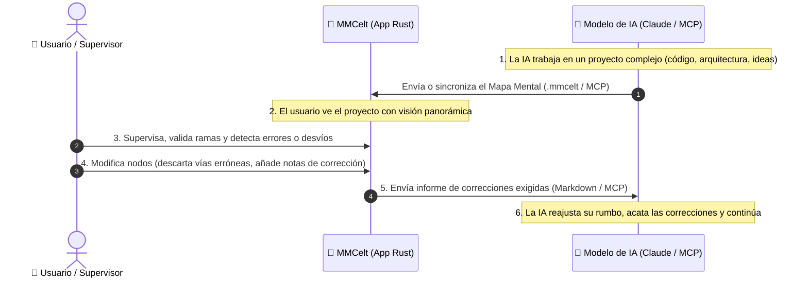

# 🔌 MMCelt: El Instrumento Bidireccional de Control y Supervisión Humano ↔ IA

> **Qué conecta MMCelt hoy.** Desde la versión 0.11.6 el programa se conecta con tres agentes de
> consola: **Claude Code**, **Codex CLI** y **Gemini CLI**. Lo que esta guía cuenta de
> Claude Desktop y Cursor se conserva como referencia de cómo funciona cada plataforma: **ya no se conectan desde
> MMCelt** (el motivo está en el [README](../../README.md#por-qué-ya-no-están-antigravity-cursor-windsurf-y-claude-desktop)).

**MMCelt** no es solo un visor de mapas mentales: es una **consola visual de control, verificación y alineación estratégica en tiempo real** entre el usuario y los modelos de Inteligencia Artificial (Claude, ChatGPT, Gemini, Cursor, etc.).

## Claude Code y Claude Desktop no se abren de la misma manera

Ambos pertenecen al ecosistema de Anthropic, pero son clientes distintos. **Claude Code** es la
consola: después de conectarlo y reiniciarlo una vez, `Enviar a… → Claude Code` guarda el mapa,
crea el expediente, abre una terminal nueva en la carpeta del proyecto y activa la vigilancia.
No tienes que abrir Claude Code antes; sí debes haber iniciado sesión en su CLI.

**Claude Desktop** es una aplicación gráfica y MMCelt no controla sus conversaciones. Conéctala
desde `Conectar MMCelt con mis IAs`, ciérrala por completo y vuelve a abrirla para que cargue MCP.
Después prepara la sesión desde MMCelt, abre tú una conversación en Claude Desktop y adjunta o
pega `.mmcelt/sesiones/<sesión>/inicio.md` o el `_AI.md` generado. Claude Desktop no debe
presuponerse capaz de abrir una ruta del proyecto solo porque tenga el MCP de MMCelt. La
conversación continúa en Claude Desktop y el mapa vuelve mediante MCP.

La consola lleva tus mensajes; MCP aporta las herramientas para leer y actualizar el mapa. Que una
de las dos capacidades funcione no demuestra la otra, y una prueba de Claude Code no sustituye la
prueba de un cliente gráfico.

---

## 🔄 El Bucle Cerrado de Trabajo Humano-en-el-Bucle (Human-in-the-loop)

---

## 🛠️ Herramientas MCP para el Control del Proyecto

El servidor MCP va integrado en el propio ejecutable (`mmcelt --mcp-server`) e incluye estas herramientas:

1. **`mmcelt_workspace_info`**: La IA pregunta cuál es la carpeta autorizada y qué mapas hay dentro, en vez de adivinar rutas. Es la primera que debe llamar; las rutas que devuelve son las que hay que reenviar tal cual.
2. **`mmcelt_create_mindmap`**: La IA genera el mapa mental visual del proyecto en el que está trabajando para que lo veas en tu pantalla.
3. **`mmcelt_read_mindmap`**: La IA lee un mapa ya existente: su jerarquía, sus notas, sus dudas abiertas y sus conexiones. Cada nodo y cada conexión vienen con su identificador y con su título, que es lo que le permite escribir después sin ambigüedad.
4. **`mmcelt_sync_ai_progress`**: La IA desarrolla un mapa que ya existe —también el que has hecho tú—: actualiza estados (`EnProgreso`, `Completado`, `DudaBloqueo`) y añade nodos con su rol y sus etiquetas, además de conexiones cruzadas entre ramas distintas.
5. **`mmcelt_get_human_feedback`**: La IA consulta si tú has modificado el mapa, validado ramas o exigido correcciones (`RequiereCorreccion`, `Descartado`).
6. **`mmcelt_export_ai_markdown`**: Exporta la especificación completa en Markdown con ingeniería de prompts.

---

## 🌱 Cómo la IA amplía un mapa tuyo sin sustituirlo

Si el mapa lo has hecho tú, `mmcelt_create_mindmap` se niega a tocarlo: rehacerlo encima
borraría tu trabajo. La vía legítima para ampliarlo es `mmcelt_sync_ai_progress`, y con ella el
agente puede añadir nodos completos —con rol y etiquetas— y trazar conexiones cruzadas entre
ramas distintas, que es lo que hace falta para dibujar un bucle o una dependencia que la
jerarquía no expresa.

Lo que el agente **no** puede hacer por esa puerta:

- Borrar un nodo tuyo o cambiarlo de sitio.
- Sustituir tus etiquetas: las suyas se añaden a las tuyas.
- Presentar su trabajo como tuyo: todo lo que añade nace **Generado por IA**.
- Firmar algo como aprobado por ti, ni conservar tu aprobación sobre un texto que ha cambiado.
- Volver a enlazar un camino que hayas marcado como **Descartado**.

Si pide una conexión imposible —un nodo que no existe, un nodo consigo mismo o una relación que
ya estaba—, no se crea y el servidor le explica por qué, en lugar de responderle que todo ha ido
bien.

---

## 🏷️ Qué pasa cuando dos nodos se llaman igual

En un diagrama de decisiones lo normal es tener dos **Sí** y dos **No** colgando de preguntas
distintas. **Puedes seguir repitiendo títulos**: el problema no es tuyo.

Antes, una petición dirigida a «Sí» caía sobre uno de los dos y la IA recibía un «hecho». Ahora,
si la petición nombra solo el título y ese título lo llevan varios nodos, **la llamada entera se
rechaza sin escribir nada** y la respuesta enumera los candidatos con su identificador, para que
la IA repita la llamada señalando el que quería.

Para poder señalarlo, cada nodo y cada conexión que lee traen su identificador:

- `mmcelt_read_mindmap` devuelve el `id` de cada nodo, y cada conexión con `from` y `to`
  —identificadores— junto a `from_title` y `to_title` —títulos—.
- `mmcelt_sync_ai_progress` acepta `id` y `parent_id` en cada nodo, y `from_id` y `to_id` en cada
  conexión. Si llegan el identificador y el título a la vez, tienen que corresponder al mismo
  nodo; si no, se rechaza, porque significa que la IA arrastra una tabla vieja del mapa.

El título por sí solo **sigue funcionando** siempre que sea único, que es el caso más común. Lo
único que ha dejado de ocurrir es que el servidor elija por su cuenta.

Un título que no existe no es lo mismo que uno ambiguo: si nombras un padre que no está en el
mapa, el nodo cuelga de la raíz y la IA recibe el aviso, igual que antes. Ambiguo significa que
hay varios sitios donde ponerlo, y ahí se para.

---

## 🛑 Cómo Corregir a la IA desde MMCelt

1. Abre el mapa en MMCelt.
2. Si la IA tomó una decisión incorrecta o un rumbo no deseado:
   - Cambia el estado del nodo a **`⛔ Descartado`** o **`⚠️ Requiere Corrección`**.
   - En el campo **"🛑 Corrección / Instrucción Exigida a la IA"**, escribe lo que debe corregir (ej. *"No usar SQLite, necesitamos PostgreSQL por volumen de escrituras concurrentes"*).
   - *(Si necesitas ayuda sobre cómo redactar o estructurar correcciones, pulsa el botón **`+info`** junto a Control Humano para abrir la guía detallada a la derecha)*.
3. Ve al menú superior **`🤖 Inteligencia Artificial` > `🛑 Enviar Correcciones y Directivas a la IA...`**.
4. Pulsa **`📋 Copiar Directivas de Corrección`** y pégalo en tu chat con la IA (o haz que Claude use `mmcelt_get_human_feedback` vía MCP).
5. La IA recibirá un informe que le ordena acatar tus correcciones y descartar las vías canceladas.

---

## 🍪 Asistencia para Nuevos Usuarios
Si estás empezando a usar MMCelt junto a Claude, activa las **Galletas de Ayuda** en el menú **`❓ Ayuda`**. Te guiarán paso a paso sobre cómo interactuar con los nodos y podrás pulsar **`+info`** en cualquier momento para desplegar la documentación exhaustiva en el panel lateral derecho.

